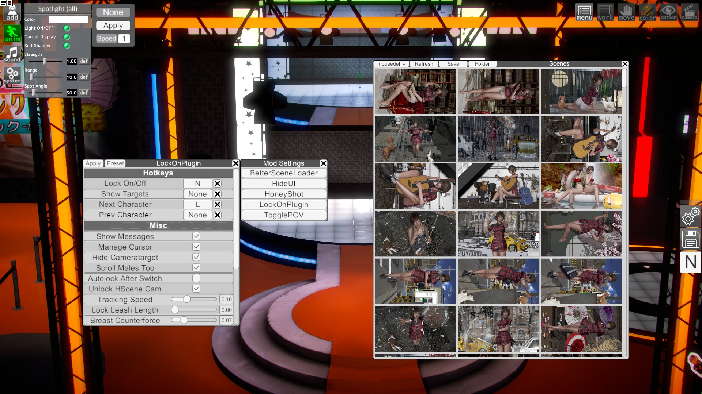

## Description
A random bunch of plugin mods for Honey Select.  
Use ModMenuManager to change your current hotkeys/settings for the mods.
 

## Installation
1. Install Illusion Plugin Architecture (IPA).
2. Throw the files into the Honey Select root folder.

## Plugins

#### BetterSceneLoader - [Download](DOWNLOADS/BetterSceneLoader.zip)
Faster to use scene loader for Studio Neo.  
*ModMenuManager is required to use this*.

#### HideUI - [Download](DOWNLOADS/HideUI.zip)
Hide all the UI with one click, hotkey is `M` by default.  
More menus can be added in `\Plugins\InterfaceSuite\HideUI.txt`.

#### LightManager - [Download](DOWNLOADS/LightManager.zip)
Currently the only use is making spotlights track characters.  
To use first select the lights you want to target and then select a character and press apply in the upper left corner.  
Importing a scene doesn't do anything at the moment.  
*[HSExtSave](http://www.hongfire.com/forum/forum/hentai-lair/hf-modding-translation/honey-select-mods/5747804) is required to use this*.

#### ModMenuManager - [Download](DOWNLOADS/ModMenuManager.zip)
A menu to manage all other mod menus.  
More menus can be added in `\Plugins\InterfaceSuite\ModMenuManager\ModMenuManager.xml`.

#### ModSettingsMenu - [Download](DOWNLOADS/ModSettingsMenu.zip)
An easily customizable settings menu for mods.  
Settings for the menu can be edited in `\Plugins\InterfaceSuite\ModSettingsMenu`.  
*ModMenuManager is required to use this*.

#### NeckLookMod - [Download Soon™](DOWNLOADS/NeckLookMod.zip)
Force character to look at other characters.  
*ModMenuManager is required to use this*.

#### TogglePOV - [Download](DOWNLOADS/TogglePOV.zip)
The original and the best POV mod for Honey Select improved and updated to the latest version.  
Default hotkey is `Backspace`.  
Core code not written by me.

## Credits
Keelhauled
Joan6694 for HSExtSave and UIUtility
Original maker of TogglePOV
